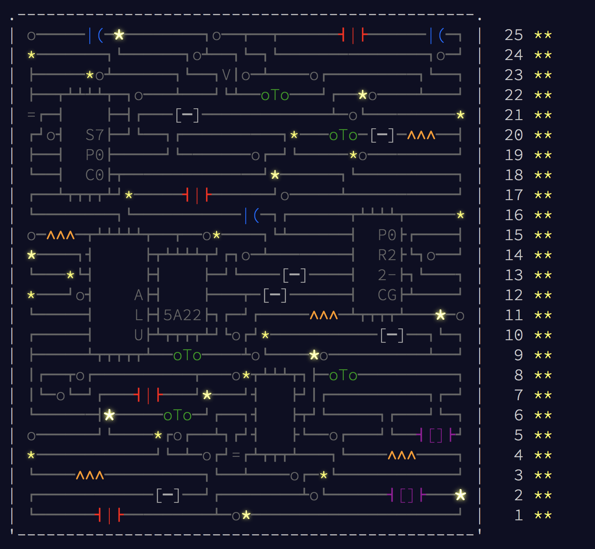
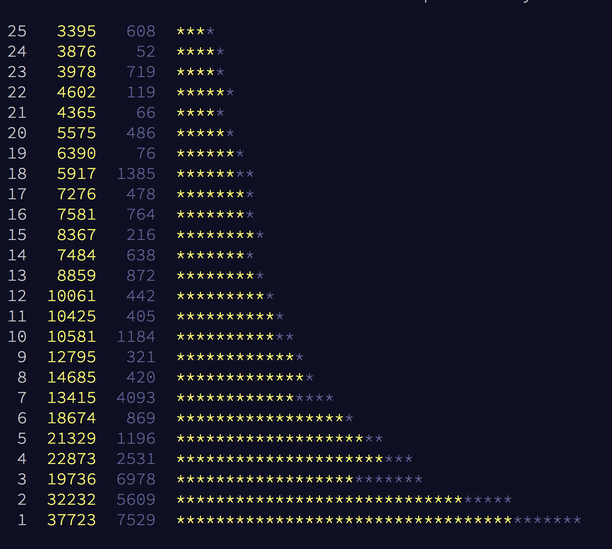

# Advent of Code: Were you nice or naughty this year?

## What's going on?
[Advent of Code](http://adventofcode.com/2017) is an annual programming challenge which consists of 25 (2-part) puzzles at different difficulty levels. I heard about it on our company's chat and it's the first edition I have participated in. The event itself is a great opportunity to learn a new programming language (I've got familiar with [Kotlin](https://kotlinlang.org)) and to compare your solutions with friends. This year's plot was about Santa's broken printer. We were shrunk and sent inside a computer to fix it in 25 ~~days~~ milliseconds. One prize for solving all the tasks (apart from satisfaction and improvement of skills) is a beautiful motherboard, procedurally-generated in real time.




## Some stats
The first puzzle was completed by over 37,000 people. Each day this number decreased except the 4th, 8th, 15th and 22nd day, when the previous days were visibly harder and skipped by a lot of people. E.g. the fastest solution of the 21st task was 10 minutes 9 seconds, in contrast to the next day's, which was 6 minutes 2 seconds. The hardest task overall seemed to be the second part of day 23, which was tackled by the top programmer in over 19 minutes. This puzzle required optimization of assembly-like code, instead of just computing a result. Finally, just over 3,000 competitors survived all 25 days.




## How were they so fast?
Top 100 programmers were so fast that I can’t even imagine how they managed to achieve these great times. Therefore, I asked the 4th best hacker this year, Samuel Cormier-Iijima (sciyoshi), about his experience with AoC.

>This was my first year participating in AoC, but I've been programming in Python for over 10 years. You can save time by building a good toolbox (mine had some tools for reading the puzzle input, and some helper classes/functions for 2D grids), but the most important part is understanding the basics of strings, arrays, sets, hashmaps, and regexes in your chosen language as well as some foundational algorithms (recursion, dynamic programming, DFS/BFS/topological sort). I also skipped straight to the puzzle descriptions and went for the simplest approach I knew would work. In tricky cases where I was unsure of something (usually related to off-by-ones), I'd run my program against the sample input. The hard part for me was keeping to a schedule and doing the problems each night at 12AM; I also struggled on some days (#6, #11 and #24), when I either rushed and didn't read carefully enough or my brain just wasn't working. My favorite problem was probably #23, which involves decompiling rather than writing code, which I don't get to do very often! I also used this as an opportunity to practice Rust, which I learned a few years ago and really love, but don't get to use regularly.

You can see Samuel's solutions here: https://github.com/sciyoshi/advent-of-rust-2017

I chose a different path of completing AoC: I focused on practising Kotlin, functional programming and paying attention to some aspects of clean code. Usually, I solved the puzzles just after work; sometimes I had to catch up a couple of days in a row. It was also difficult to keep up with the schedule since in Poland the tasks were published very early in the morning. I agree with Samuel that some parts of code could be reused between puzzles, which was very helpful. Another crucial thing was to choose a programming language wisely for this type of contest. I would recommend Python if you aim toward the top scores.

## An example solution (spoiler alert)
This paragraph presents an example functional solution to the 21st day's "Fractal Art" exercise, which was one of the most labour-intensive and also one of my favorites.

### Intro
We start with the following ASCII art:
```
.#.
..#
###
```
The pattern is a 3x3 square, so it has a size of 3.
Another thing we get as the input is the artist's book of enhancement rules, which tells us how to transform our pattern.

Then, we repeat this process:
* If the size of the image is evenly divisible by 2, break it into 2x2 squares, and convert each 2x2 square into a 3x3 square with the corresponding rule from the artist's book, e.g.
```
                #.|.#
#..#            ..|..
....    ===>    --+--
....            ..|..
#..#            #.|.#
```
* Otherwise, the size is evenly divisible by 3; break the image into 3x3 squares, and convert each 3x3 square into a 4x4 square by following the corresponding rule.

As we can see, the image increases in size after every such transformation.

The book of rules (our puzzle input) is incomplete. So, we may have to rotate or flip the input pattern to find a match. For example, the book may look like this:
```
../.# => ##./#../...
.#./..#/### => #..#/..../..../#..#
```
Pattern's rows are separated by slashes. Let’s split them to clarify:
```
..              ##.
.#      ===>    #..
                ...
                
.#.             #..#
..#     ===>    ....
###             ....
                #..#
``` 

The puzzle was to count active pixels (`#`) after n iterations.

The entire content is available on: http://adventofcode.com/2017/day/21

### The main part
We have to repeat the process of:
* dividing the image,
* transforming it in accordance to the book of rules,
* merging the transformed sub-images.

So, the main part of the solution looks like this:
```kotlin
val image = (0 until iterations).fold(startPattern, { acc, _ ->
    val divided = divide(acc)

    val transformed = divided.map {
        it.map { transform(it, rules) }
    }

    merge(transformed)
})
```
where `rules` is a `Map<String, String>`.

### Dividing
Suppose we have the following `divide` function:
```kotlin
fun divide(pattern: String): List<List<String>> {
    val lines = pattern.split("/")
    val size = lines[0].length

    if (size == 2 || size == 3) return listOf(listOf(pattern))

    return if (size % 2 == 0 && size > 2)
        divide(lines, 2)
    else if (size % 3 == 0 && size > 3)
        divide(lines, 3)
    else throw IllegalArgumentException("Wrong pattern")
}
```
which does not require further explanation and is an entry point for the proper divide function:
```kotlin
fun divide(lines: List<String>, divisor: Int): List<List<String>> =
    lines
        .map { it.chunked(divisor) }.chunked(divisor)
        .map { groupByIndex(it) }
        .map { it.map { it.joinToString("/") } }
```
The first map uses a Kotlin feature which produces a list of chunks with specified size.
This is done twice as we wanted to divide columns as well as rows. Then, we need to group our pixels by indexes in chunks to produce proper patterns. Finally, we have to merge rows together with slashes. You can see better how it works by looking at the [Spock](http://spockframework.org/) specification for the `divide` function (written in Groovy):
```groovy
def "should divide"() {
    expect:
    new Day21FractalArt().divide(input) == result

    where:
    input                                       || result
    "#..#/..../..../#..#"                       || [["#./..", ".#/.."], ["../#.", "../.#"]]
    "#...../.#..../..#.../...#../....#./.....#" || [["#./.#", "../..", "../.."], ["../..", "#./.#", "../.."], ["../..", "../..", "#./.#"]]
}
```

### Transforming
The tail recursive `transform` function takes a pattern, a book of rules and a counter of rotations. After 4 rotations a pattern returns to the starting position, so we throw an exception. Then the series of `if` statements checks if there is a corresponding rule for one of the possible combinations of positions.
```kotlin
tailrec fun transform(pattern: String, rules: Map<String, String>, rotateCounter: Int = 0): String {
    if (rotateCounter > 3) throw IllegalArgumentException("Rule not found")

    if (pattern in rules) return rules[pattern]!!

    val horizontalFlip = flipHorizontally(pattern)
    if (horizontalFlip in rules) return rules[horizontalFlip]!!
    val verticalFlip = flipVertically(pattern)
    if (verticalFlip in rules) return rules[verticalFlip]!!
    if (flipVertically(horizontalFlip) in rules) return rules[flipVertically(horizontalFlip)]!!

    return transform(rotate(pattern), rules, rotateCounter + 1)
}
```
Note that the double exclamation marks convert returned values to non-null types (learn more about Null-safety [here](https://kotlinlang.org/docs/reference/null-safety.html)).
To see how the `flip` and `rotate` functions are implemented, visit my GitHub.


### Merging
The `merge` function first splits rows by slashes, then groups pixels with the same function as in the `dividing` phase. Finally, it merges all pixels together.
```kotlin
fun merge(dividedPattern: List<List<String>>): String =
    dividedPattern.map { it.map { it.split("/") } }
        .map { groupByIndex(it) }
        .joinToString("/") {
            it.joinToString("/") {
                it.joinToString("")
            }
        }
```
An example test should clarify how it works:
```groovy
def "should merge"() {
    expect:
    new Day21FractalArt().merge(input) == result

    where:
    input                                    || result
    [["#./..", ".#/.."], [".#/##", "../.#"]] || "#..#/..../.#../##.#"
}
```

### Outro
All my solutions can be found on my GitHub: https://github.com/Hoobie/adventofcode

They are written in Kotlin and almost all of them are [functional](https://en.wikipedia.org/wiki/Functional_programming).

## Last few words
I hope you had fun reading this post and maybe even solving the Advent of Code tasks. Remember, even if you didn’t finish some of the puzzles, you still can. There is no time limit. The puzzles from the previous editions are also available.
If you have any remarks, let us know in comments.

Happy New Year to everyone!
